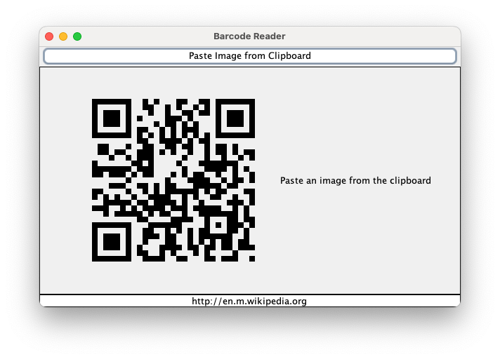

# Barcode Reader Application

This is a Java Swing-based application that allows users to paste an image from the clipboard, display the image, and decode the barcode or QR code content using the ZXing library. The decoded content is displayed below the image.



## Prerequisites

- Java 17 or higher
- Maven 3.6 or higher

## How to Run

### For Linux or macOS:
   - Download the [JAR file](https://github.com/wehnerm/barcode-reader-app-swing-gui/releases/download/0.1.0/barcode-reader-app-0.1.0.jar) and the [`run.sh` script](https://github.com/wehnerm/barcode-reader-app-swing-gui/releases/download/0.1.0/run.sh).
   - Place them in the same directory.
   - Make the script executable: `chmod +x run.sh`.
   - Double-click the script to run the application.

### For Windows:
   - Download the [JAR file](https://github.com/wehnerm/barcode-reader-app-swing-gui/releases/download/0.1.0/barcode-reader-app-0.1.0.jar) and the [`run.bat` script](https://github.com/wehnerm/barcode-reader-app-swing-gui/releases/download/0.1.0/run.bat).
   - Place them in the same directory.
   - Double-click the script to run the application.

#### Notes
   - Ensure Java is installed and added to your system's PATH.
   - The JAR file (`barcode-reader-app-0.1.0.jar`) must be in the same directory as the script.

### From source code

1. Clone or download the project to your local machine.
2. Navigate to the project directory in your terminal.
3. Compile the project using Maven:
   ```bash
   mvn clean package
    ```
4. Run the application:
   ```bash
   java -jar target/barcode-reader-app-0.1.0.jar
    ```
   or use the provided `run.sh` or `run.bat` scripts.
   
## Debugging

To see the content of the jar file, you can use the following command:
```bash
jar tf target/barcode-reader-app-0.1.0.jar
```